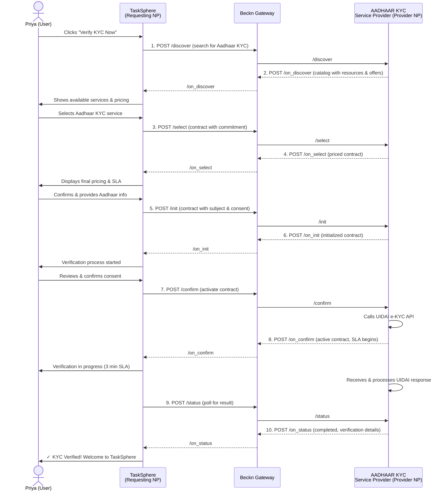

# Verification Service Network — End-to-End Flows & Test Scenarios

## Overview

This document is the primary reference guide for implementers testing their Requesting NP (Network Participant) or Provider NP integration with the Beckn Verification Service Network. The Verification Service domain enables secure, interoperable verification of identity documents, credentials, and financial accounts using the Beckn Protocol v2.0 (Generalised) with the Resource/Offer/Contract (ROC) model.

**Domain Code:** `verification-service`
**Schema Pack Version:** 2.1.0
**Protocol Version:** Beckn Protocol v2.0 (Generalised)
**Model:** Resource/Offer/Contract (ROC)

This kit covers four primary use cases with detailed flow diagrams, realistic JSON payloads, and implementation notes. Use this as your blueprint for testing, debugging, and validating your network implementation.

---

## UC2 — Identity Verification (Aadhaar KYC)

### Reference Implementation

This use case is the **deep reference implementation**. Priya Sharma, a freelance content creator in Mumbai, wants to join a gig platform that requires Aadhaar-based KYC verification before she can accept assignments.

### Scenario Narrative

Priya Sharma is a 28-year-old freelance content creator from Mumbai who specializes in product photography and video editing. She wants to join a gig platform called "TaskSphere" that offers short-term assignments. TaskSphere's compliance team requires all creators to complete Aadhaar-based KYC before onboarding, as per RBI and MeitY guidelines.

Priya has her Aadhaar number (5234-1234-5678) and has consented to e-KYC verification via AADHAAR_EKYC. She initiates the KYC process on TaskSphere's mobile app. TaskSphere (Requesting NP) searches for an Aadhaar KYC verification service provider on the Beckn network, discovers a Provider NP offering Aadhaar verification with SLA of 5 minutes and pricing of 10 rupees per verification. Priya selects this service, provides her Aadhaar details, and the Provider NP performs the verification using UIDAI's official channels. Within 3 minutes, the verification completes successfully. The platform receives confirmation that Priya's identity is verified with 98% confidence, her details are extracted, and she can now accept assignments.

### Mermaid Sequence Diagram



### Complete JSON Payloads for All 10 API Calls

#### 1. DISCOVER — Requesting NP searches for Aadhaar KYC services

```json
{
  "context": {
    "domain": "verification-service",
    "action": "discover",
    "version": "2.0.0",
    "bapId": "tasksphere-bap.example.com",
    "bapUri": "https://tasksphere-bap.example.com",
    "transactionId": "txn-aadhaar-priya-2026-04-07-001",
    "messageId": "msg-discover-001",
    "timestamp": "2026-04-07T10:15:00Z",
    "schemaContext": [
      "https://schema.beckn.org/verification-service/2.1.0/domain_context.jsonld",
      "https://schema.beckn.org/verification-service/2.1.0/context.jsonld"
    ]
  },
  "message": {
    "intent": {
      "textSearch": "aadhaar identity verification",
      "spatial": [
        {
          "gps": "19.0760,72.8777"
        }
      ]
    }
  }
}
```

**Key Points:**
- Context uses camelCase: `bapId`, `bapUri`, `transactionId`, `messageId`
- Intent contains `textSearch` and optional `spatial` array
- NO `beckn:` prefix anywhere
- Domain is `verification-service`

---

#### 2. ON_DISCOVER — Provider NP responds with catalog of verification services

```json
{
  "context": {
    "domain": "verification-service",
    "action": "on_discover",
    "version": "2.0.0",
    "bapId": "tasksphere-bap.example.com",
    "bapUri": "https://tasksphere-bap.example.com",
    "bppId": "aadhaar-kyc-bpp.example.com",
    "bppUri": "https://aadhaar-kyc-bpp.example.com",
    "transactionId": "txn-aadhaar-priya-2026-04-07-001",
    "messageId": "msg-on-discover-001",
    "timestamp": "2026-04-07T10:15:15Z",
    "schemaContext": [
      "https://schema.beckn.org/verification-service/2.1.0/domain_context.jsonld",
      "https://schema.beckn.org/verification-service/2.1.0/context.jsonld"
    ]
  },
  "message": {
    "catalog": {
      "id": "cat-aadhaar-kyc-001",
      "descriptor": {
        "name": "AADHAAR KYC Verification Services"
      },
      "provider": {
        "id": "provider-aadhaar-kyc-001",
        "descriptor": {
          "name": "IndiaVerify - AADHAAR KYC Service"
        }
      },
      "resources": [
        {
          "id": "res-aadhaar-ekyc-001",
          "descriptor": {
            "name": "AADHAAR e-KYC Verification",
            "shortDesc": "Verify identity using AADHAAR with UIDAI official channels",
            "longDesc": "Real-time e-KYC verification against AADHAAR database with 98% accuracy"
          },
          "resourceAttributes": {
            "@context": "https://schema.beckn.org/verification-service/VerificationResource/v2.1/context.jsonld",
            "@type": "vr:VerificationResource",
            "verificationType": {
              "code": "IDENTITY",
              "name": "AADHAAR e-KYC"
            },
            "verificationMethod": {
              "code": "AADHAAR_EKYC",
              "name": "UIDAI e-KYC API Integration"
            },
            "acceptanceConfidence": 98,
            "processingTime": {
              "duration": "PT3M"
            }
          }
        }
      ],
      "offers": [
        {
          "id": "offer-aadhaar-001",
          "descriptor": {
            "name": "Standard AADHAAR Verification",
            "code": "OFFER-STD-AADHAAR-001"
          },
          "resourceIds": ["res-aadhaar-ekyc-001"],
          "offerAttributes": {
            "@context": "https://schema.beckn.org/verification-service/VerificationOffer/v2.1/context.jsonld",
            "@type": "vo:VerificationOffer",
            "pricing": {
              "currency": "INR",
              "amount": 10.00
            },
            "sla": {
              "completionTime": {
                "duration": "PT5M"
              }
            }
          }
        }
      ]
    }
  }
}
```

**Key Points:**
- Catalog has NO `@context` or `@type` at the top level
- Catalog is PLAIN object with: `id`, `descriptor`, `provider`, `resources`, `offers`
- Resource objects contain `resourceAttributes` with `@context` and `@type` (REQUIRED)
- Offer objects contain `offerAttributes` with `@context` and `@type` (REQUIRED)
- Descriptor uses `name`, `shortDesc`, `longDesc`, `code` — NOT `schema:name`
- NO `beckn:` prefix anywhere

---

#### 3. SELECT — Requesting NP selects the offer and creates contract

```json
{
  "context": {
    "domain": "verification-service",
    "action": "select",
    "version": "2.0.0",
    "bapId": "tasksphere-bap.example.com",
    "bapUri": "https://tasksphere-bap.example.com",
    "bppId": "aadhaar-kyc-bpp.example.com",
    "bppUri": "https://aadhaar-kyc-bpp.example.com",
    "transactionId": "txn-aadhaar-priya-2026-04-07-001",
    "messageId": "msg-select-001",
    "timestamp": "2026-04-07T10:16:00Z",
    "schemaContext": [
      "https://schema.beckn.org/verification-service/2.1.0/domain_context.jsonld",
      "https://schema.beckn.org/verification-service/2.1.0/context.jsonld"
    ]
  },
  "message": {
    "order": {
      "id": "contract-aadhaar-priya-001",
      "descriptor": {
        "name": "AADHAAR KYC for Priya Sharma"
      },
      "resources": [
        {
          "id": "res-aadhaar-ekyc-001",
          "descriptor": {
            "name": "AADHAAR e-KYC Verification"
          },
          "quantity": {
            "count": 1
          }
        }
      ],
      "offers": [
        {
          "id": "offer-aadhaar-001",
          "resourceIds": ["res-aadhaar-ekyc-001"]
        }
      ],
      "commitments": [
        {
          "id": "commit-aadhaar-001",
          "resources": [
            {
              "id": "res-aadhaar-ekyc-001",
              "quantity": {
                "count": 1
              }
            }
          ],
          "offer": {
            "id": "offer-aadhaar-001",
            "resourceIds": ["res-aadhaar-ekyc-001"]
          }
        }
      ],
      "participants": [
        {
          "id": "participant-tasksphere-001",
          "descriptor": {
            "name": "TaskSphere Gig Platform"
          },
          "participantAttributes": {
            "@context": "https://schema.beckn.org/verification-service/VerificationContract/v2.1/context.jsonld",
            "@type": "vc:VerificationContract",
            "organizationType": "REQUESTING_PLATFORM",
            "referenceId": "TASK-PRIYA-ONBOARD-2026"
          }
        }
      ]
    }
  }
}
```

**Key Points:**
- Order (contract) contains `resources`, `offers`, `commitments`, `participants`
- Commitment has `id`, `resources` (with `quantity.count`), `offer`
- Participant has NO `role` field in the base schema — role/type is conveyed via `participantAttributes`
- `participantAttributes` MUST include `@context` and `@type`
- Quantity is an object: `{ "count": 1 }` (NOT `{ "beckn:count": 1 }`)

---

#### 4. ON_SELECT — Provider NP returns priced contract

```json
{
  "context": {
    "domain": "verification-service",
    "action": "on_select",
    "version": "2.0.0",
    "bapId": "tasksphere-bap.example.com",
    "bapUri": "https://tasksphere-bap.example.com",
    "bppId": "aadhaar-kyc-bpp.example.com",
    "bppUri": "https://aadhaar-kyc-bpp.example.com",
    "transactionId": "txn-aadhaar-priya-2026-04-07-001",
    "messageId": "msg-on-select-001",
    "timestamp": "2026-04-07T10:16:15Z",
    "schemaContext": [
      "https://schema.beckn.org/verification-service/2.1.0/domain_context.jsonld",
      "https://schema.beckn.org/verification-service/2.1.0/context.jsonld"
    ]
  },
  "message": {
    "order": {
      "id": "contract-aadhaar-priya-001",
      "descriptor": {
        "name": "AADHAAR KYC for Priya Sharma - Priced"
      },
      "price": {
        "currency": "INR",
        "value": "10.00"
      },
      "resources": [
        {
          "id": "res-aadhaar-ekyc-001",
          "descriptor": {
            "name": "AADHAAR e-KYC Verification"
          },
          "quantity": {
            "count": 1
          }
        }
      ],
      "offers": [
        {
          "id": "offer-aadhaar-001",
          "resourceIds": ["res-aadhaar-ekyc-001"]
        }
      ],
      "commitments": [
        {
          "id": "commit-aadhaar-001",
          "status": {
            "descriptor": {
              "code": "DRAFT"
            }
          },
          "resources": [
            {
              "id": "res-aadhaar-ekyc-001",
              "quantity": {
                "count": 1
              }
            }
          ],
          "offer": {
            "id": "offer-aadhaar-001",
            "resourceIds": ["res-aadhaar-ekyc-001"]
          }
        }
      ],
      "participants": [
        {
          "id": "participant-tasksphere-001",
          "descriptor": {
            "name": "TaskSphere Gig Platform"
          },
          "participantAttributes": {
            "@context": "https://schema.beckn.org/verification-service/VerificationContract/v2.1/context.jsonld",
            "@type": "vc:VerificationContract",
            "organizationType": "REQUESTING_PLATFORM"
          }
        }
      ]
    }
  }
}
```

**Key Points:**
- Order now includes `price` object with `currency` and `value`
- Commitment status uses nested descriptor: `status: { "descriptor": { "code": "DRAFT" } }`
- Status codes: DRAFT, COMMITTED, ACTIVE, COMPLETED

---

#### 5. INIT — Requesting NP provides identity details and consent

```json
{
  "context": {
    "domain": "verification-service",
    "action": "init",
    "version": "2.0.0",
    "bapId": "tasksphere-bap.example.com",
    "bapUri": "https://tasksphere-bap.example.com",
    "bppId": "aadhaar-kyc-bpp.example.com",
    "bppUri": "https://aadhaar-kyc-bpp.example.com",
    "transactionId": "txn-aadhaar-priya-2026-04-07-001",
    "messageId": "msg-init-001",
    "timestamp": "2026-04-07T10:17:00Z",
    "schemaContext": [
      "https://schema.beckn.org/verification-service/2.1.0/domain_context.jsonld",
      "https://schema.beckn.org/verification-service/2.1.0/context.jsonld"
    ]
  },
  "message": {
    "order": {
      "id": "contract-aadhaar-priya-001",
      "descriptor": {
        "name": "AADHAAR KYC for Priya Sharma - Initialized"
      },
      "price": {
        "currency": "INR",
        "value": "10.00"
      },
      "resources": [
        {
          "id": "res-aadhaar-ekyc-001",
          "descriptor": {
            "name": "AADHAAR e-KYC Verification"
          },
          "quantity": {
            "count": 1
          }
        }
      ],
      "offers": [
        {
          "id": "offer-aadhaar-001",
          "resourceIds": ["res-aadhaar-ekyc-001"]
        }
      ],
      "commitments": [
        {
          "id": "commit-aadhaar-001",
          "status": {
            "descriptor": {
              "code": "DRAFT"
            }
          },
          "resources": [
            {
              "id": "res-aadhaar-ekyc-001",
              "descriptor": {
                "name": "AADHAAR e-KYC Verification"
              },
              "quantity": {
                "count": 1
              },
              "resourceAttributes": {
                "@context": "https://schema.beckn.org/verification-service/VerificationResource/v2.1/context.jsonld",
                "@type": "vr:VerificationResource",
                "subjectIdentifier": {
                  "identifierType": "AADHAAR",
                  "value": "5234-1234-5678"
                },
                "consentAcknowledgement": {
                  "consentId": "consent-aadhaar-priya-001",
                  "status": "ACKNOWLEDGED",
                  "timestamp": "2026-04-07T10:17:00Z",
                  "consentDetails": {
                    "purpose": "AADHAAR_EKYC_VERIFICATION",
                    "dataElements": ["NAME", "DOB", "GENDER", "ADDRESS"]
                  }
                }
              }
            }
          ],
          "offer": {
            "id": "offer-aadhaar-001",
            "resourceIds": ["res-aadhaar-ekyc-001"]
          }
        }
      ],
      "participants": [
        {
          "id": "participant-tasksphere-001",
          "descriptor": {
            "name": "TaskSphere Gig Platform"
          },
          "participantAttributes": {
            "@context": "https://schema.beckn.org/verification-service/VerificationContract/v2.1/context.jsonld",
            "@type": "vc:VerificationContract",
            "organizationType": "REQUESTING_PLATFORM"
          }
        },
        {
          "id": "participant-subject-priya-001",
          "descriptor": {
            "name": "Priya Sharma"
          },
          "participantAttributes": {
            "@context": "https://schema.beckn.org/verification-service/VerificationContract/v2.1/context.jsonld",
            "@type": "vc:VerificationContract",
            "subjectType": "INDIVIDUAL",
            "referenceId": "PRIYA-TASKSPHERE-2026-04-07"
          }
        }
      ]
    }
  }
}
```

**Key Points:**
- Resource within commitment now includes `resourceAttributes` with identity details and consent
- Consent is embedded in `consentAcknowledgement` within resourceAttributes
- Participants include both the requesting platform and the subject (individual being verified)
- Subject has `subjectType` and other identifiers in participantAttributes

---

#### 6. ON_INIT — Provider NP acknowledges receipt and validates identity

```json
{
  "context": {
    "domain": "verification-service",
    "action": "on_init",
    "version": "2.0.0",
    "bapId": "tasksphere-bap.example.com",
    "bapUri": "https://tasksphere-bap.example.com",
    "bppId": "aadhaar-kyc-bpp.example.com",
    "bppUri": "https://aadhaar-kyc-bpp.example.com",
    "transactionId": "txn-aadhaar-priya-2026-04-07-001",
    "messageId": "msg-on-init-001",
    "timestamp": "2026-04-07T10:17:15Z",
    "schemaContext": [
      "https://schema.beckn.org/verification-service/2.1.0/domain_context.jsonld",
      "https://schema.beckn.org/verification-service/2.1.0/context.jsonld"
    ]
  },
  "message": {
    "order": {
      "id": "contract-aadhaar-priya-001",
      "descriptor": {
        "name": "AADHAAR KYC for Priya Sharma - Initialized & Validated"
      },
      "price": {
        "currency": "INR",
        "value": "10.00"
      },
      "resources": [
        {
          "id": "res-aadhaar-ekyc-001",
          "descriptor": {
            "name": "AADHAAR e-KYC Verification"
          },
          "quantity": {
            "count": 1
          }
        }
      ],
      "offers": [
        {
          "id": "offer-aadhaar-001",
          "resourceIds": ["res-aadhaar-ekyc-001"]
        }
      ],
      "commitments": [
        {
          "id": "commit-aadhaar-001",
          "status": {
            "descriptor": {
              "code": "DRAFT"
            }
          },
          "resources": [
            {
              "id": "res-aadhaar-ekyc-001",
              "descriptor": {
                "name": "AADHAAR e-KYC Verification"
              },
              "quantity": {
                "count": 1
              },
              "resourceAttributes": {
                "@context": "https://schema.beckn.org/verification-service/VerificationResource/v2.1/context.jsonld",
                "@type": "vr:VerificationResource",
                "subjectIdentifier": {
                  "identifierType": "AADHAAR",
                  "value": "5234-1234-5678"
                },
                "consentAcknowledgement": {
                  "consentId": "consent-aadhaar-priya-001",
                  "status": "ACKNOWLEDGED",
                  "timestamp": "2026-04-07T10:17:00Z",
                  "consentDetails": {
                    "purpose": "AADHAAR_EKYC_VERIFICATION",
                    "dataElements": ["NAME", "DOB", "GENDER", "ADDRESS"]
                  }
                },
                "validationStatus": {
                  "code": "VALIDATED",
                  "name": "Identity data validated and ready for verification"
                }
              }
            }
          ],
          "offer": {
            "id": "offer-aadhaar-001",
            "resourceIds": ["res-aadhaar-ekyc-001"]
          }
        }
      ],
      "participants": [
        {
          "id": "participant-tasksphere-001",
          "descriptor": {
            "name": "TaskSphere Gig Platform"
          },
          "participantAttributes": {
            "@context": "https://schema.beckn.org/verification-service/VerificationContract/v2.1/context.jsonld",
            "@type": "vc:VerificationContract",
            "organizationType": "REQUESTING_PLATFORM"
          }
        }
      ]
    }
  }
}
```

**Key Points:**
- Provider NP acknowledges receipt and adds `validationStatus` to resourceAttributes
- Commitment remains in DRAFT status until confirmation

---

#### 7. CONFIRM — Requesting NP activates the contract (starts verification)

```json
{
  "context": {
    "domain": "verification-service",
    "action": "confirm",
    "version": "2.0.0",
    "bapId": "tasksphere-bap.example.com",
    "bapUri": "https://tasksphere-bap.example.com",
    "bppId": "aadhaar-kyc-bpp.example.com",
    "bppUri": "https://aadhaar-kyc-bpp.example.com",
    "transactionId": "txn-aadhaar-priya-2026-04-07-001",
    "messageId": "msg-confirm-001",
    "timestamp": "2026-04-07T10:18:00Z",
    "schemaContext": [
      "https://schema.beckn.org/verification-service/2.1.0/domain_context.jsonld",
      "https://schema.beckn.org/verification-service/2.1.0/context.jsonld"
    ]
  },
  "message": {
    "order": {
      "id": "contract-aadhaar-priya-001",
      "descriptor": {
        "name": "AADHAAR KYC for Priya Sharma - Confirmed"
      },
      "price": {
        "currency": "INR",
        "value": "10.00"
      },
      "resources": [
        {
          "id": "res-aadhaar-ekyc-001",
          "descriptor": {
            "name": "AADHAAR e-KYC Verification"
          },
          "quantity": {
            "count": 1
          }
        }
      ],
      "offers": [
        {
          "id": "offer-aadhaar-001",
          "resourceIds": ["res-aadhaar-ekyc-001"]
        }
      ],
      "commitments": [
        {
          "id": "commit-aadhaar-001",
          "status": {
            "descriptor": {
              "code": "ACTIVE"
            }
          },
          "resources": [
            {
              "id": "res-aadhaar-ekyc-001",
              "descriptor": {
                "name": "AADHAAR e-KYC Verification"
              },
              "quantity": {
                "count": 1
              }
            }
          ],
          "offer": {
            "id": "offer-aadhaar-001",
            "resourceIds": ["res-aadhaar-ekyc-001"]
          }
        }
      ],
      "participants": [
        {
          "id": "participant-tasksphere-001",
          "descriptor": {
            "name": "TaskSphere Gig Platform"
          }
        }
      ]
    }
  }
}
```

**Key Points:**
- Commitment status changes to ACTIVE
- This triggers the Provider NP to begin actual verification (UIDAI call, etc.)

---

#### 8. ON_CONFIRM — Provider NP confirms activation, SLA begins

```json
{
  "context": {
    "domain": "verification-service",
    "action": "on_confirm",
    "version": "2.0.0",
    "bapId": "tasksphere-bap.example.com",
    "bapUri": "https://tasksphere-bap.example.com",
    "bppId": "aadhaar-kyc-bpp.example.com",
    "bppUri": "https://aadhaar-kyc-bpp.example.com",
    "transactionId": "txn-aadhaar-priya-2026-04-07-001",
    "messageId": "msg-on-confirm-001",
    "timestamp": "2026-04-07T10:18:15Z",
    "schemaContext": [
      "https://schema.beckn.org/verification-service/2.1.0/domain_context.jsonld",
      "https://schema.beckn.org/verification-service/2.1.0/context.jsonld"
    ]
  },
  "message": {
    "order": {
      "id": "contract-aadhaar-priya-001",
      "descriptor": {
        "name": "AADHAAR KYC for Priya Sharma - Active"
      },
      "price": {
        "currency": "INR",
        "value": "10.00"
      },
      "resources": [
        {
          "id": "res-aadhaar-ekyc-001",
          "descriptor": {
            "name": "AADHAAR e-KYC Verification"
          },
          "quantity": {
            "count": 1
          }
        }
      ],
      "offers": [
        {
          "id": "offer-aadhaar-001",
          "resourceIds": ["res-aadhaar-ekyc-001"]
        }
      ],
      "commitments": [
        {
          "id": "commit-aadhaar-001",
          "status": {
            "descriptor": {
              "code": "ACTIVE"
            }
          },
          "resources": [
            {
              "id": "res-aadhaar-ekyc-001",
              "descriptor": {
                "name": "AADHAAR e-KYC Verification"
              },
              "quantity": {
                "count": 1
              },
              "resourceAttributes": {
                "@context": "https://schema.beckn.org/verification-service/VerificationResource/v2.1/context.jsonld",
                "@type": "vr:VerificationResource",
                "processingStatus": {
                  "code": "IN_PROGRESS",
                  "name": "Verification in progress with UIDAI"
                },
                "slaTimeline": {
                  "slaStart": "2026-04-07T10:18:15Z",
                  "expectedCompletion": "2026-04-07T10:21:15Z"
                }
              }
            }
          ],
          "offer": {
            "id": "offer-aadhaar-001",
            "resourceIds": ["res-aadhaar-ekyc-001"]
          }
        }
      ],
      "participants": [
        {
          "id": "participant-tasksphere-001",
          "descriptor": {
            "name": "TaskSphere Gig Platform"
          }
        }
      ]
    }
  }
}
```

**Key Points:**
- Commitment now ACTIVE
- Resource includes `processingStatus` and `slaTimeline` in resourceAttributes
- SLA countdown started

---

#### 9. STATUS — Requesting NP polls for completion

```json
{
  "context": {
    "domain": "verification-service",
    "action": "status",
    "version": "2.0.0",
    "bapId": "tasksphere-bap.example.com",
    "bapUri": "https://tasksphere-bap.example.com",
    "bppId": "aadhaar-kyc-bpp.example.com",
    "bppUri": "https://aadhaar-kyc-bpp.example.com",
    "transactionId": "txn-aadhaar-priya-2026-04-07-001",
    "messageId": "msg-status-001",
    "timestamp": "2026-04-07T10:20:00Z",
    "schemaContext": [
      "https://schema.beckn.org/verification-service/2.1.0/domain_context.jsonld",
      "https://schema.beckn.org/verification-service/2.1.0/context.jsonld"
    ]
  },
  "message": {
    "orderId": "contract-aadhaar-priya-001"
  }
}
```

**Key Points:**
- Status request is minimal — just the orderId in the message
- Requesting NP polls at regular intervals (e.g., every 30 seconds until SLA expires)

---

#### 10. ON_STATUS — Provider NP returns completed verification

```json
{
  "context": {
    "domain": "verification-service",
    "action": "on_status",
    "version": "2.0.0",
    "bapId": "tasksphere-bap.example.com",
    "bapUri": "https://tasksphere-bap.example.com",
    "bppId": "aadhaar-kyc-bpp.example.com",
    "bppUri": "https://aadhaar-kyc-bpp.example.com",
    "transactionId": "txn-aadhaar-priya-2026-04-07-001",
    "messageId": "msg-on-status-001",
    "timestamp": "2026-04-07T10:20:45Z",
    "schemaContext": [
      "https://schema.beckn.org/verification-service/2.1.0/domain_context.jsonld",
      "https://schema.beckn.org/verification-service/2.1.0/context.jsonld"
    ]
  },
  "message": {
    "order": {
      "id": "contract-aadhaar-priya-001",
      "descriptor": {
        "name": "AADHAAR KYC for Priya Sharma - VERIFIED"
      },
      "price": {
        "currency": "INR",
        "value": "10.00"
      },
      "resources": [
        {
          "id": "res-aadhaar-ekyc-001",
          "descriptor": {
            "name": "AADHAAR e-KYC Verification"
          },
          "quantity": {
            "count": 1
          }
        }
      ],
      "offers": [
        {
          "id": "offer-aadhaar-001",
          "resourceIds": ["res-aadhaar-ekyc-001"]
        }
      ],
      "commitments": [
        {
          "id": "commit-aadhaar-001",
          "status": {
            "descriptor": {
              "code": "COMPLETED"
            }
          },
          "resources": [
            {
              "id": "res-aadhaar-ekyc-001",
              "descriptor": {
                "name": "AADHAAR e-KYC Verification"
              },
              "quantity": {
                "count": 1
              },
              "resourceAttributes": {
                "@context": "https://schema.beckn.org/verification-service/VerificationResource/v2.1/context.jsonld",
                "@type": "vr:VerificationResource",
                "verificationResult": {
                  "code": "VERIFIED",
                  "name": "Identity successfully verified",
                  "confidence": 98
                },
                "extractedData": {
                  "name": "Priya Sharma",
                  "aadhaarNumber": "5234-1234-5678",
                  "dateOfBirth": "1998-06-15",
                  "gender": "Female",
                  "address": "Mumbai, Maharashtra, India"
                },
                "processingStatus": {
                  "code": "COMPLETED",
                  "name": "Verification completed successfully"
                },
                "slaTimeline": {
                  "slaStart": "2026-04-07T10:18:15Z",
                  "completionTime": "2026-04-07T10:20:45Z",
                  "actualDuration": "PT2M30S"
                }
              }
            }
          ],
          "offer": {
            "id": "offer-aadhaar-001",
            "resourceIds": ["res-aadhaar-ekyc-001"]
          }
        }
      ],
      "settlements": [
        {
          "id": "settlement-aadhaar-001",
          "status": "COMPLETE",
          "payeeInfo": {
            "name": "IndiaVerify - AADHAAR KYC",
            "accountNumber": "9876543210"
          },
          "amount": {
            "currency": "INR",
            "value": "10.00"
          }
        }
      ],
      "participants": [
        {
          "id": "participant-tasksphere-001",
          "descriptor": {
            "name": "TaskSphere Gig Platform"
          }
        }
      ]
    }
  }
}
```

**Key Points:**
- Commitment status is COMPLETED
- Resource includes complete `verificationResult` with confidence score and extracted data
- Settlement is included with status COMPLETE (plain string, not descriptor)
- Settlement status values: DRAFT, COMMITTED, COMPLETE (plain strings, not descriptors)

---

## UC1 — Driving Licence Verification

### Scenario Narrative

Ravi Kumar is a 35-year-old commercial driver transporting goods on the Kanpur–Delhi route. He wants to join "RideMate," a freight logistics network that requires driver credential verification. RideMate searches for a driving licence verification provider, finds one offering real-time verification against SARATHI database with 99% accuracy. Ravi provides his licence details, and within 2 minutes, his credentials are verified and he is onboarded.

### Minimal Flow (Discover → Confirm → Status)

#### 1. DISCOVER — Searching for driving licence verification

```json
{
  "context": {
    "domain": "verification-service",
    "action": "discover",
    "version": "2.0.0",
    "bapId": "ridemate-bap.example.com",
    "bapUri": "https://ridemate-bap.example.com",
    "transactionId": "txn-driving-ravi-2026-04-07-002",
    "messageId": "msg-discover-002",
    "timestamp": "2026-04-07T14:00:00Z",
    "schemaContext": [
      "https://schema.beckn.org/verification-service/2.1.0/domain_context.jsonld",
      "https://schema.beckn.org/verification-service/2.1.0/context.jsonld"
    ]
  },
  "message": {
    "intent": {
      "textSearch": "driving license verification sarathi"
    }
  }
}
```

#### 2. ON_DISCOVER — Driving licence service catalog

```json
{
  "context": {
    "domain": "verification-service",
    "action": "on_discover",
    "version": "2.0.0",
    "bapId": "ridemate-bap.example.com",
    "bapUri": "https://ridemate-bap.example.com",
    "bppId": "sarathi-verify-bpp.example.com",
    "bppUri": "https://sarathi-verify-bpp.example.com",
    "transactionId": "txn-driving-ravi-2026-04-07-002",
    "messageId": "msg-on-discover-002",
    "timestamp": "2026-04-07T14:00:15Z",
    "schemaContext": [
      "https://schema.beckn.org/verification-service/2.1.0/domain_context.jsonld",
      "https://schema.beckn.org/verification-service/2.1.0/context.jsonld"
    ]
  },
  "message": {
    "catalog": {
      "id": "cat-sarathi-driving-001",
      "descriptor": {
        "name": "SARATHI Driving Licence Verification Services"
      },
      "provider": {
        "id": "provider-sarathi-001",
        "descriptor": {
          "name": "SafeRoads - SARATHI Integration"
        }
      },
      "resources": [
        {
          "id": "res-driving-sarathi-001",
          "descriptor": {
            "name": "Commercial Driving Licence Verification",
            "shortDesc": "Real-time verification against SARATHI database"
          },
          "resourceAttributes": {
            "@context": "https://schema.beckn.org/verification-service/VerificationResource/v2.1/context.jsonld",
            "@type": "vr:VerificationResource",
            "verificationType": {
              "code": "DRIVING_LICENCE",
              "name": "SARATHI Commercial Driving Licence"
            },
            "verificationMethod": {
              "code": "SARATHI_LIVE",
              "name": "Real-time SARATHI Database Lookup"
            },
            "acceptanceConfidence": 99
          }
        }
      ],
      "offers": [
        {
          "id": "offer-driving-001",
          "descriptor": {
            "name": "Commercial Licence Verification"
          },
          "resourceIds": ["res-driving-sarathi-001"],
          "offerAttributes": {
            "@context": "https://schema.beckn.org/verification-service/VerificationOffer/v2.1/context.jsonld",
            "@type": "vo:VerificationOffer",
            "pricing": {
              "currency": "INR",
              "amount": 15.00
            },
            "sla": {
              "completionTime": {
                "duration": "PT2M"
              }
            }
          }
        }
      ]
    }
  }
}
```

#### 3. CONFIRM — Ravi provides licence details and confirms

```json
{
  "context": {
    "domain": "verification-service",
    "action": "confirm",
    "version": "2.0.0",
    "bapId": "ridemate-bap.example.com",
    "bapUri": "https://ridemate-bap.example.com",
    "bppId": "sarathi-verify-bpp.example.com",
    "bppUri": "https://sarathi-verify-bpp.example.com",
    "transactionId": "txn-driving-ravi-2026-04-07-002",
    "messageId": "msg-confirm-002",
    "timestamp": "2026-04-07T14:01:30Z",
    "schemaContext": [
      "https://schema.beckn.org/verification-service/2.1.0/domain_context.jsonld",
      "https://schema.beckn.org/verification-service/2.1.0/context.jsonld"
    ]
  },
  "message": {
    "order": {
      "id": "contract-driving-ravi-001",
      "descriptor": {
        "name": "Driving Licence Verification for Ravi Kumar"
      },
      "price": {
        "currency": "INR",
        "value": "15.00"
      },
      "resources": [
        {
          "id": "res-driving-sarathi-001",
          "descriptor": {
            "name": "Commercial Driving Licence Verification"
          },
          "quantity": {
            "count": 1
          },
          "resourceAttributes": {
            "@context": "https://schema.beckn.org/verification-service/VerificationResource/v2.1/context.jsonld",
            "@type": "vr:VerificationResource",
            "subjectIdentifier": {
              "identifierType": "DRIVING_LICENCE_NUMBER",
              "value": "DL0920250015671"
            }
          }
        }
      ],
      "offers": [
        {
          "id": "offer-driving-001",
          "resourceIds": ["res-driving-sarathi-001"]
        }
      ],
      "commitments": [
        {
          "id": "commit-driving-001",
          "status": {
            "descriptor": {
              "code": "ACTIVE"
            }
          },
          "resources": [
            {
              "id": "res-driving-sarathi-001",
              "quantity": {
                "count": 1
              }
            }
          ],
          "offer": {
            "id": "offer-driving-001",
            "resourceIds": ["res-driving-sarathi-001"]
          }
        }
      ],
      "participants": [
        {
          "id": "participant-ridemate-001",
          "descriptor": {
            "name": "RideMate Logistics"
          },
          "participantAttributes": {
            "@context": "https://schema.beckn.org/verification-service/VerificationContract/v2.1/context.jsonld",
            "@type": "vc:VerificationContract",
            "organizationType": "REQUESTING_PLATFORM"
          }
        }
      ]
    }
  }
}
```

#### 4. ON_STATUS — Driving licence verification complete

```json
{
  "context": {
    "domain": "verification-service",
    "action": "on_status",
    "version": "2.0.0",
    "bapId": "ridemate-bap.example.com",
    "bapUri": "https://ridemate-bap.example.com",
    "bppId": "sarathi-verify-bpp.example.com",
    "bppUri": "https://sarathi-verify-bpp.example.com",
    "transactionId": "txn-driving-ravi-2026-04-07-002",
    "messageId": "msg-on-status-002",
    "timestamp": "2026-04-07T14:02:00Z",
    "schemaContext": [
      "https://schema.beckn.org/verification-service/2.1.0/domain_context.jsonld",
      "https://schema.beckn.org/verification-service/2.1.0/context.jsonld"
    ]
  },
  "message": {
    "order": {
      "id": "contract-driving-ravi-001",
      "descriptor": {
        "name": "Driving Licence Verification for Ravi Kumar - VERIFIED"
      },
      "price": {
        "currency": "INR",
        "value": "15.00"
      },
      "resources": [
        {
          "id": "res-driving-sarathi-001",
          "descriptor": {
            "name": "Commercial Driving Licence Verification"
          },
          "quantity": {
            "count": 1
          },
          "resourceAttributes": {
            "@context": "https://schema.beckn.org/verification-service/VerificationResource/v2.1/context.jsonld",
            "@type": "vr:VerificationResource",
            "verificationResult": {
              "code": "VERIFIED",
              "name": "Licence verified and valid",
              "confidence": 99
            },
            "extractedData": {
              "licenceNumber": "DL0920250015671",
              "holderName": "Ravi Kumar",
              "licenceCategory": "HCV",
              "expiryDate": "2027-05-20",
              "status": "ACTIVE"
            }
          }
        }
      ],
      "offers": [
        {
          "id": "offer-driving-001",
          "resourceIds": ["res-driving-sarathi-001"]
        }
      ],
      "commitments": [
        {
          "id": "commit-driving-001",
          "status": {
            "descriptor": {
              "code": "COMPLETED"
            }
          },
          "resources": [
            {
              "id": "res-driving-sarathi-001",
              "quantity": {
                "count": 1
              }
            }
          ],
          "offer": {
            "id": "offer-driving-001",
            "resourceIds": ["res-driving-sarathi-001"]
          }
        }
      ],
      "settlements": [
        {
          "id": "settlement-driving-001",
          "status": "COMPLETE",
          "payeeInfo": {
            "name": "SafeRoads - SARATHI Integration"
          },
          "amount": {
            "currency": "INR",
            "value": "15.00"
          }
        }
      ]
    }
  }
}
```

---

## UC3 — Bank Account Verification

### Scenario Narrative

Ravi Kumar (same driver from UC1) needs to verify his bank account for payroll setup on the RideMate platform. A Provider NP checks the account against the NPCI AADHAR Seeding Registry (ASR) and confirms the account is active and properly linked to his Aadhaar. Verification completes in 1 minute.

#### 1. DISCOVER — Bank account verification

```json
{
  "context": {
    "domain": "verification-service",
    "action": "discover",
    "version": "2.0.0",
    "bapId": "ridemate-bap.example.com",
    "bapUri": "https://ridemate-bap.example.com",
    "transactionId": "txn-bank-ravi-2026-04-07-003",
    "messageId": "msg-discover-003",
    "timestamp": "2026-04-07T15:00:00Z",
    "schemaContext": [
      "https://schema.beckn.org/verification-service/2.1.0/domain_context.jsonld",
      "https://schema.beckn.org/verification-service/2.1.0/context.jsonld"
    ]
  },
  "message": {
    "intent": {
      "textSearch": "bank account verification asr npci"
    }
  }
}
```

#### 2. CONFIRM — Ravi provides account details

```json
{
  "context": {
    "domain": "verification-service",
    "action": "confirm",
    "version": "2.0.0",
    "bapId": "ridemate-bap.example.com",
    "bapUri": "https://ridemate-bap.example.com",
    "bppId": "npci-bank-verify-bpp.example.com",
    "bppUri": "https://npci-bank-verify-bpp.example.com",
    "transactionId": "txn-bank-ravi-2026-04-07-003",
    "messageId": "msg-confirm-003",
    "timestamp": "2026-04-07T15:02:00Z",
    "schemaContext": [
      "https://schema.beckn.org/verification-service/2.1.0/domain_context.jsonld",
      "https://schema.beckn.org/verification-service/2.1.0/context.jsonld"
    ]
  },
  "message": {
    "order": {
      "id": "contract-bank-ravi-001",
      "descriptor": {
        "name": "Bank Account Verification for Ravi Kumar"
      },
      "price": {
        "currency": "INR",
        "value": "5.00"
      },
      "resources": [
        {
          "id": "res-bank-asr-001",
          "descriptor": {
            "name": "Bank Account ASR Verification"
          },
          "quantity": {
            "count": 1
          },
          "resourceAttributes": {
            "@context": "https://schema.beckn.org/verification-service/VerificationResource/v2.1/context.jsonld",
            "@type": "vr:VerificationResource",
            "subjectIdentifier": {
              "identifierType": "BANK_ACCOUNT_IFSC",
              "value": "HDFC0002021"
            },
            "accountDetails": {
              "accountNumber": "50100123456789",
              "ifscCode": "HDFC0002021",
              "accountType": "SAVINGS"
            }
          }
        }
      ],
      "offers": [
        {
          "id": "offer-bank-001",
          "resourceIds": ["res-bank-asr-001"]
        }
      ],
      "commitments": [
        {
          "id": "commit-bank-001",
          "status": {
            "descriptor": {
              "code": "ACTIVE"
            }
          },
          "resources": [
            {
              "id": "res-bank-asr-001",
              "quantity": {
                "count": 1
              }
            }
          ],
          "offer": {
            "id": "offer-bank-001",
            "resourceIds": ["res-bank-asr-001"]
          }
        }
      ]
    }
  }
}
```

#### 3. ON_STATUS — Bank account verified

```json
{
  "context": {
    "domain": "verification-service",
    "action": "on_status",
    "version": "2.0.0",
    "bapId": "ridemate-bap.example.com",
    "bapUri": "https://ridemate-bap.example.com",
    "bppId": "npci-bank-verify-bpp.example.com",
    "bppUri": "https://npci-bank-verify-bpp.example.com",
    "transactionId": "txn-bank-ravi-2026-04-07-003",
    "messageId": "msg-on-status-003",
    "timestamp": "2026-04-07T15:02:45Z",
    "schemaContext": [
      "https://schema.beckn.org/verification-service/2.1.0/domain_context.jsonld",
      "https://schema.beckn.org/verification-service/2.1.0/context.jsonld"
    ]
  },
  "message": {
    "order": {
      "id": "contract-bank-ravi-001",
      "descriptor": {
        "name": "Bank Account Verification for Ravi Kumar - VERIFIED"
      },
      "price": {
        "currency": "INR",
        "value": "5.00"
      },
      "resources": [
        {
          "id": "res-bank-asr-001",
          "descriptor": {
            "name": "Bank Account ASR Verification"
          },
          "quantity": {
            "count": 1
          },
          "resourceAttributes": {
            "@context": "https://schema.beckn.org/verification-service/VerificationResource/v2.1/context.jsonld",
            "@type": "vr:VerificationResource",
            "verificationResult": {
              "code": "VERIFIED",
              "name": "Account verified in ASR",
              "confidence": 95
            },
            "extractedData": {
              "accountStatus": "ACTIVE",
              "aadhaarSeeded": true,
              "bankName": "HDFC Bank Ltd"
            }
          }
        }
      ],
      "offers": [
        {
          "id": "offer-bank-001",
          "resourceIds": ["res-bank-asr-001"]
        }
      ],
      "commitments": [
        {
          "id": "commit-bank-001",
          "status": {
            "descriptor": {
              "code": "COMPLETED"
            }
          },
          "resources": [
            {
              "id": "res-bank-asr-001",
              "quantity": {
                "count": 1
              }
            }
          ],
          "offer": {
            "id": "offer-bank-001",
            "resourceIds": ["res-bank-asr-001"]
          }
        }
      ],
      "settlements": [
        {
          "id": "settlement-bank-001",
          "status": "COMPLETE",
          "amount": {
            "currency": "INR",
            "value": "5.00"
          }
        }
      ]
    }
  }
}
```

---

## UC4 — Skill Certificate Verification

### Scenario Narrative

Ankit Patel is an electrician from Ahmedabad who wants to list his services on a platform that requires verified technical credentials. He has a completed ITI (Industrial Training Institute) electrician certificate. The verification service checks the certificate against the National Apprenticeship Promotion Scheme (NAPS) registry and confirms his credentials are valid.

#### 1. DISCOVER — ITI certificate verification

```json
{
  "context": {
    "domain": "verification-service",
    "action": "discover",
    "version": "2.0.0",
    "bapId": "skillshare-bap.example.com",
    "bapUri": "https://skillshare-bap.example.com",
    "transactionId": "txn-iti-ankit-2026-04-07-004",
    "messageId": "msg-discover-004",
    "timestamp": "2026-04-07T16:00:00Z",
    "schemaContext": [
      "https://schema.beckn.org/verification-service/2.1.0/domain_context.jsonld",
      "https://schema.beckn.org/verification-service/2.1.0/context.jsonld"
    ]
  },
  "message": {
    "intent": {
      "textSearch": "iti certificate electrician verification naps"
    }
  }
}
```

#### 2. CONFIRM — Ankit provides certificate details

```json
{
  "context": {
    "domain": "verification-service",
    "action": "confirm",
    "version": "2.0.0",
    "bapId": "skillshare-bap.example.com",
    "bapUri": "https://skillshare-bap.example.com",
    "bppId": "naps-skill-verify-bpp.example.com",
    "bppUri": "https://naps-skill-verify-bpp.example.com",
    "transactionId": "txn-iti-ankit-2026-04-07-004",
    "messageId": "msg-confirm-004",
    "timestamp": "2026-04-07T16:02:30Z",
    "schemaContext": [
      "https://schema.beckn.org/verification-service/2.1.0/domain_context.jsonld",
      "https://schema.beckn.org/verification-service/2.1.0/context.jsonld"
    ]
  },
  "message": {
    "order": {
      "id": "contract-iti-ankit-001",
      "descriptor": {
        "name": "ITI Certificate Verification for Ankit Patel"
      },
      "price": {
        "currency": "INR",
        "value": "8.00"
      },
      "resources": [
        {
          "id": "res-iti-naps-001",
          "descriptor": {
            "name": "ITI Electrician Certificate Verification"
          },
          "quantity": {
            "count": 1
          },
          "resourceAttributes": {
            "@context": "https://schema.beckn.org/verification-service/VerificationResource/v2.1/context.jsonld",
            "@type": "vr:VerificationResource",
            "subjectIdentifier": {
              "identifierType": "ITI_CERTIFICATE_NUMBER",
              "value": "ITI-AHD-2024-45890"
            },
            "certificateDetails": {
              "trade": "Electrician",
              "year": 2024,
              "instituteCode": "GIT-AHMEDABAD-001"
            }
          }
        }
      ],
      "offers": [
        {
          "id": "offer-iti-001",
          "resourceIds": ["res-iti-naps-001"]
        }
      ],
      "commitments": [
        {
          "id": "commit-iti-001",
          "status": {
            "descriptor": {
              "code": "ACTIVE"
            }
          },
          "resources": [
            {
              "id": "res-iti-naps-001",
              "quantity": {
                "count": 1
              }
            }
          ],
          "offer": {
            "id": "offer-iti-001",
            "resourceIds": ["res-iti-naps-001"]
          }
        }
      ]
    }
  }
}
```

#### 3. ON_STATUS — ITI certificate verified

```json
{
  "context": {
    "domain": "verification-service",
    "action": "on_status",
    "version": "2.0.0",
    "bapId": "skillshare-bap.example.com",
    "bapUri": "https://skillshare-bap.example.com",
    "bppId": "naps-skill-verify-bpp.example.com",
    "bppUri": "https://naps-skill-verify-bpp.example.com",
    "transactionId": "txn-iti-ankit-2026-04-07-004",
    "messageId": "msg-on-status-004",
    "timestamp": "2026-04-07T16:03:45Z",
    "schemaContext": [
      "https://schema.beckn.org/verification-service/2.1.0/domain_context.jsonld",
      "https://schema.beckn.org/verification-service/2.1.0/context.jsonld"
    ]
  },
  "message": {
    "order": {
      "id": "contract-iti-ankit-001",
      "descriptor": {
        "name": "ITI Certificate Verification for Ankit Patel - VERIFIED"
      },
      "price": {
        "currency": "INR",
        "value": "8.00"
      },
      "resources": [
        {
          "id": "res-iti-naps-001",
          "descriptor": {
            "name": "ITI Electrician Certificate Verification"
          },
          "quantity": {
            "count": 1
          },
          "resourceAttributes": {
            "@context": "https://schema.beckn.org/verification-service/VerificationResource/v2.1/context.jsonld",
            "@type": "vr:VerificationResource",
            "verificationResult": {
              "code": "VERIFIED",
              "name": "Certificate verified in NAPS registry",
              "confidence": 97
            },
            "extractedData": {
              "candidateName": "Ankit Patel",
              "trade": "Electrician",
              "certificateStatus": "VALID",
              "completionDate": "2024-07-30",
              "aggregateScore": 82
            }
          }
        }
      ],
      "offers": [
        {
          "id": "offer-iti-001",
          "resourceIds": ["res-iti-naps-001"]
        }
      ],
      "commitments": [
        {
          "id": "commit-iti-001",
          "status": {
            "descriptor": {
              "code": "COMPLETED"
            }
          },
          "resources": [
            {
              "id": "res-iti-naps-001",
              "quantity": {
                "count": 1
              }
            }
          ],
          "offer": {
            "id": "offer-iti-001",
            "resourceIds": ["res-iti-naps-001"]
          }
        }
      ],
      "settlements": [
        {
          "id": "settlement-iti-001",
          "status": "COMPLETE",
          "amount": {
            "currency": "INR",
            "value": "8.00"
          }
        }
      ]
    }
  }
}
```

---

## Common Integration Mistakes

### 1. Using `beckn:` Prefix in JSON Payloads

**WRONG:**
```json
{
  "message": {
    "catalog": {
      "beckn:id": "cat-001",
      "beckn:descriptor": { "beckn:name": "Service" },
      "beckn:resources": [...]
    }
  }
}
```

**RIGHT:**
```json
{
  "message": {
    "catalog": {
      "id": "cat-001",
      "descriptor": { "name": "Service" },
      "resources": [...]
    }
  }
}
```

The `beckn:` prefix appears ONLY in JSON-LD `@context` files, never in API payloads.

---

### 2. Using snake_case in Context

**WRONG:**
```json
{
  "context": {
    "bap_id": "...",
    "bap_uri": "...",
    "transaction_id": "...",
    "message_id": "..."
  }
}
```

**RIGHT:**
```json
{
  "context": {
    "bapId": "...",
    "bapUri": "...",
    "transactionId": "...",
    "messageId": "..."
  }
}
```

The context object uses **camelCase** for all properties.

---

### 3. Adding @context/@type to Catalog Top Level

**WRONG:**
```json
{
  "message": {
    "catalog": {
      "@context": "...",
      "@type": "...",
      "id": "...",
      "descriptor": { "name": "..." }
    }
  }
}
```

**RIGHT:**
```json
{
  "message": {
    "catalog": {
      "id": "...",
      "descriptor": { "name": "..." },
      "provider": { ... },
      "resources": [...],
      "offers": [...]
    }
  }
}
```

Catalog is a plain object. Only Attributes blocks (resourceAttributes, offerAttributes, etc.) have @context/@type.

---

### 4. Forgetting @context/@type in Attributes

**WRONG:**
```json
{
  "resourceAttributes": {
    "verificationType": { "code": "IDENTITY" },
    "acceptanceConfidence": 98
  }
}
```

**RIGHT:**
```json
{
  "resourceAttributes": {
    "@context": "https://schema.beckn.org/verification-service/VerificationResource/v2.1/context.jsonld",
    "@type": "vr:VerificationResource",
    "verificationType": { "code": "IDENTITY" },
    "acceptanceConfidence": 98
  }
}
```

All Attributes blocks (resource, offer, contract, performance) MUST include `@context` and `@type`.

---

### 5. Using Descriptor Properties Incorrectly

**WRONG:**
```json
{
  "descriptor": {
    "schema:name": "Identity Verification",
    "schema:description": "Verify identity"
  }
}
```

**RIGHT:**
```json
{
  "descriptor": {
    "name": "Identity Verification",
    "shortDesc": "Quick identity check",
    "longDesc": "Comprehensive identity verification using official documents"
  }
}
```

Descriptors use plain `name`, `shortDesc`, `longDesc`, `code` — NOT `schema:name` or similar.

---

### 6. Including `role` Field in Participant

**WRONG:**
```json
{
  "participants": [{
    "id": "participant-001",
    "descriptor": { "name": "Platform A" },
    "role": "REQUESTING_PLATFORM"
  }]
}
```

**RIGHT:**
```json
{
  "participants": [{
    "id": "participant-001",
    "descriptor": { "name": "Platform A" },
    "participantAttributes": {
      "@context": "...",
      "@type": "...",
      "organizationType": "REQUESTING_PLATFORM"
    }
  }]
}
```

Participant has no `role` field in the core schema. Use `participantAttributes` with the appropriate schema to express role/type.

---

### 7. Incorrect Quantity Structure

**WRONG:**
```json
{
  "quantity": {
    "beckn:count": 1
  }
}
```

**RIGHT:**
```json
{
  "quantity": {
    "count": 1
  }
}
```

Quantity is a plain object: `{ "count": <number> }`. No prefixes.

---

### 8. Settlement Status as Descriptor Instead of String

**WRONG:**
```json
{
  "settlements": [{
    "id": "...",
    "status": {
      "descriptor": {
        "code": "COMPLETE"
      }
    }
  }]
}
```

**RIGHT:**
```json
{
  "settlements": [{
    "id": "...",
    "status": "COMPLETE"
  }]
}
```

Settlement status is a plain string enum: DRAFT, COMMITTED, COMPLETE.

---

### 9. Commitment Status Descriptor Pattern

**WRONG:**
```json
{
  "commitments": [{
    "id": "...",
    "status": "ACTIVE"
  }]
}
```

**RIGHT:**
```json
{
  "commitments": [{
    "id": "...",
    "status": {
      "descriptor": {
        "code": "ACTIVE"
      }
    }
  }]
}
```

Commitment status (unlike Settlement status) uses the nested descriptor pattern.

---

### 10. Missing Transaction ID Consistency

**WRONG:**
```json
{
  "context": {
    "transactionId": "txn-001"
  }
}
```
Then in another message:
```json
{
  "context": {
    "transactionId": "txn-002"
  }
}
```

**RIGHT:**

All messages in a single end-to-end flow MUST use the same `transactionId`. Only `messageId` changes with each API call.

---

## Validation Checklist

When implementing or testing your Beckn Verification Service Network integration, verify the following:

### Context Structure
- [ ] All context fields use **camelCase**: `bapId`, `bapUri`, `bppId`, `bppUri`, `transactionId`, `messageId`
- [ ] `transactionId` is consistent across all 10 calls in a single flow
- [ ] `messageId` is unique per API call
- [ ] `timestamp` is ISO 8601 format with Z suffix (UTC)
- [ ] `schemaContext` array includes both domain and context files
- [ ] `version` is "2.0.0"

### Catalog (in on_discover)
- [ ] Catalog is a **plain object** — NO `@context` or `@type` at top level
- [ ] Catalog includes: `id`, `descriptor`, `provider`, `resources`, `offers`
- [ ] Descriptor has `name`, optionally `shortDesc`, `longDesc`, `code` — NO `schema:name`
- [ ] Resources array is present with at least one resource

### Resources
- [ ] Each resource has `id`, `descriptor`, `resourceAttributes`, `quantity`
- [ ] `resourceAttributes` MUST include `@context` and `@type`
- [ ] `quantity` is `{ "count": <number> }` — NO prefixes
- [ ] Descriptor uses `name`, NOT `schema:name`

### Offers
- [ ] Each offer has `id`, `descriptor`, `resourceIds`, `offerAttributes`
- [ ] `offerAttributes` MUST include `@context` and `@type`
- [ ] `resourceIds` is an array of resource IDs referenced
- [ ] Descriptor uses `name`, NOT `schema:name`

### Order/Contract
- [ ] Order has `id`, `descriptor`, `price`, `resources`, `offers`, `commitments`, `participants`
- [ ] `price` object has `currency` and `value` (string)
- [ ] Each commitment has `id`, `status`, `resources`, `offer`
- [ ] Commitment `status` uses nested descriptor: `{ "descriptor": { "code": "ACTIVE" } }`
- [ ] Commitment status codes: DRAFT, COMMITTED, ACTIVE, COMPLETED

### Participants
- [ ] Each participant has `id`, `descriptor`, `participantAttributes`
- [ ] `participantAttributes` MUST include `@context` and `@type`
- [ ] NO `role` field in participant — role is in participantAttributes
- [ ] Descriptor uses `name`, NOT `schema:name`

### Settlements (in on_status with completion)
- [ ] Settlement has `id`, `status`, `payeeInfo` (optional), `amount`
- [ ] `status` is a **plain string**: "DRAFT", "COMMITTED", or "COMPLETE"
- [ ] NOT a descriptor — just the string value

### API Payloads
- [ ] NO `beckn:` prefix anywhere in JSON payloads
- [ ] All object keys are plain property names
- [ ] All nested objects follow the same rules

### Sequence & IDs
- [ ] All 10 API calls use the same `transactionId`
- [ ] Each message has a unique `messageId` (e.g., msg-discover-001, msg-on-discover-001, etc.)
- [ ] Order/contract ID is consistent across all messages for a single transaction
- [ ] Commitment ID is consistent when referenced

---

## Summary

This document provides production-ready examples for the Beckn Verification Service Network using the Resource/Offer/Contract (ROC) model. Key takeaways:

1. **No `beckn:` prefixes in JSON payloads** — prefixes appear only in JSON-LD context files.
2. **camelCase in context** — `bapId`, `transactionId`, `messageId`, etc.
3. **Plain catalog object** — no `@context`/`@type` at the top level; only Attributes blocks have them.
4. **Descriptor uses `name`** — not `schema:name`.
5. **Commitment status is descriptor-based** — `{ "descriptor": { "code": "ACTIVE" } }`.
6. **Settlement status is a string** — "COMPLETE" (not a descriptor).
7. **Participant has no `role`** — convey role via `participantAttributes` with the appropriate schema.
8. **Attributes blocks MUST include @context and @type** — required by the base Attributes schema.
9. **Quantity is plain** — `{ "count": 1 }` (no prefixes).
10. **Transaction ID is consistent** — same across all 10 API calls in a flow; `messageId` is unique per call.

Use these templates and the validation checklist as your reference during development and testing.
